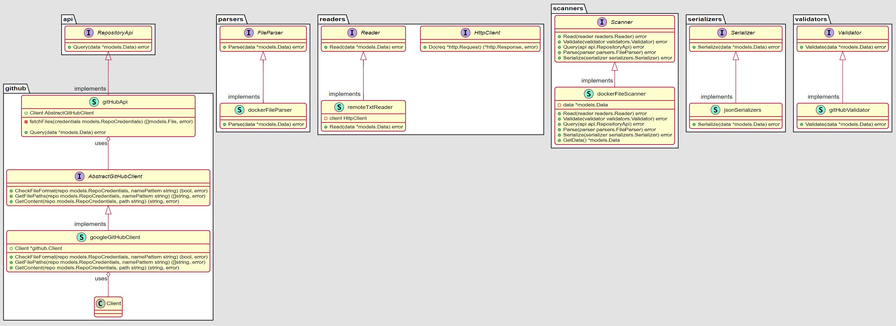

# Implementation

The overall implementation is mainly based on the Bridge pattern. The components are divided into abstractions and
implementations. The main component, called `scanner`, is accepts dependency through injection at runtime. To achieve
this, the scanner is dependent on polymorphism of other components. In other words, every writer or reader, which
implements an accepted interface, can get injected.

The main interface of the scanner object is implemented as a chain of responsibility. There are multiple steps and each
of the steps can through an error while executing, thus stopping the execution of the program. It also makes the error
handling more centralized: the errors are being propagated to the top, and the scanner object is the only one which is
allowed to act upon them.

The scanner interface has the following structure:

```go
package test

func TestScanner(t *testing.T) {

	// Arrange
	scanner := scanners.DockerFileScanner("https://test.com/test.txt")

	// Act
	var err error
	err = scanner.Read(readers.RemoteTxtReader(&MockHttpClient{}))
	err = scanner.Validate(validators.GitHubValidator())
	err = scanner.Query(github.Api(&MockGitHubClient{}))
	err = scanner.Parse(parsers.DockerFileParser())
	err = scanner.Serialize(serializers.JsonSerializers())

	// Assert
	if scanner.GetData().Output == "" || err != nil {
		t.Error()
	}
}
```

The application's frontend is built as a CLI. The app accepts command line arguments and decides on the flow of the
program. It makes up a kind of a state machine, where multiple transition between states get performed based on the
configuration passed. It is also a builder pattern, since the order of execution is offloaded to a separate object,
which is not aware of a concrete implementations.

**The app can be run as a CLI in the following way:**

```shell
./scanner -i http://github.com/ -p Dockerfile -v github -o json
```

The CLI interface also makes the app flexible enough to run in different environments, including locally.

### 3rd party components

* [Google GitHub Client](https://github.com/moby/buildkit) for retrieving data from the GitHub
* [Moby Buildkit](https://github.com/moby/buildkit) for parsing Dockerfiles

All in all, it allows for further extension of the components. We can introduce different kinds of input readers, api
clients, vendor specific checks and serializers.



# Scripts and commands

* Unit tests can be triggered with the `./test.sh` command
* The following command `./run.sh` can be used for local development. It builds and pushes the image, and then applies
  the k8s manifests.

# Considerations for improvement

* We can introduce a Helm chart to make the collection of manifests more consistent.
* Originally the entire Moby BuildKit was included into the project. However, the package is quite huge in itself, and I
  decided to retrieve only the needed component. However, a better reference to the existing Open Source project is
  needed!
* The main.go package can be inproved. Instead of if - else statement, we can offload the flow to a better state 
  machine, as in this [example](https://github.com/avshiliaev/design-patterns-in-c-sharp/tree/master/Behavioral/State).
  The application would gain in complexity though.
* We can also parallelize the [part](src/api/github/github_api.go) of the flow, making requests to the Repository Api.
  Mutex on the Data struct would be sufficient to avoid racing conditions. 
